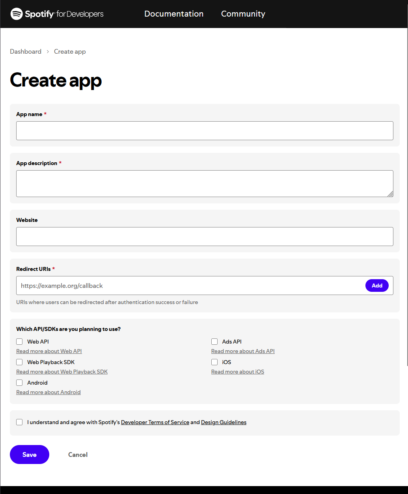

# Configurazione del tuo account sviluppatore Spotify

## Perché è necessario un account sviluppatore Spotify?

Questo script utilizza la Web API di Spotify per recuperare le tue playlist.  
Per accedere all'API, devi autenticarti tramite OAuth, il che richiede:

- Un **Client ID** e **Client Secret** dal pannello sviluppatore Spotify.
- Un **Redirect URI** registrato per completare in sicurezza il flusso di autenticazione.

> **Nota:** Il tuo account sviluppatore può essere lo stesso account Spotify che utilizzi normalmente. Creare un'app
> sviluppatore **non influisce** sulle tue playlist o sul tuo utilizzo dell'account.

---

## Come creare il tuo account sviluppatore Spotify

### 1. Accedi al pannello sviluppatore Spotify

- Vai su [developer.spotify.com/dashboard](https://developer.spotify.com/dashboard)
- Clicca su **“Log In”** ed effettua l'accesso con le tue credenziali Spotify.

---

### 2. Accetta i termini per sviluppatori

- Al primo accesso, Spotify ti chiederà di accettare i **Termini di Servizio per Sviluppatori**.
- Leggili e accetta per continuare.

---

### 3. Crea una nuova applicazione

1. Clicca su **“Create an App”**.
2. Inserisci un **nome per l'app** (es. *My Playlists Exporter*).
3. Inserisci una **descrizione per l'app** (opzionale).
4. Accetta i termini per sviluppatori se richiesto.
5. Clicca su **“Create”**.

---

### 4. Ottieni il tuo Client ID e Client Secret

- Dopo aver creato l'app, vedrai:
  - **Client ID** (visibile immediatamente)
  - **Client Secret** (clicca su **“Show Client Secret”** per visualizzarlo)

Copia entrambi i valori e aggiungili al tuo file `.env`.

---

### 5. Configura il Redirect URI

1. Nel pannello della tua app, clicca su **“Edit Settings”**.
2. Sotto **Redirect URIs**, aggiungi: <http://127.0.0.1:8000/callback> *(o l'URI esatto configurato nel tuo `.env`)*.
3. Clicca su **Save**.

> **Per maggiori informazioni:**  
> Consulta
> la [documentazione ufficiale Spotify sui Redirect URIs](https://developer.spotify.com/documentation/web-api/concepts/redirect_uri)
> per dettagli completi.

---

## Prossimi passi

✅ Il tuo account sviluppatore è pronto.  
✅ Modifica il tuo file `.env` con i valori corretti di *Client ID*, *Client Secret* e *Redirect URI*, quindi esegui lo
script per iniziare a esportare le tue playlist.

---

## Disclaimer

Le credenziali della tua app sviluppatore Spotify sono personali.  
Non condividere pubblicamente il tuo Client Secret né inserirlo in un sistema di versionamento.

## Avviso sul marchio registrato

Spotify è un marchio registrato di Spotify AB.  
Questo progetto **non è affiliato, sponsorizzato o approvato da Spotify** in alcun modo.  
Tutti i riferimenti a Spotify sono effettuati esclusivamente a scopo informativo ed educativo.

Eventuali screenshot o immagini utilizzate in questa documentazione hanno solo scopo illustrativo per aiutare gli utenti
a configurare il proprio account sviluppatore e non implicano alcuna associazione con Spotify AB.
